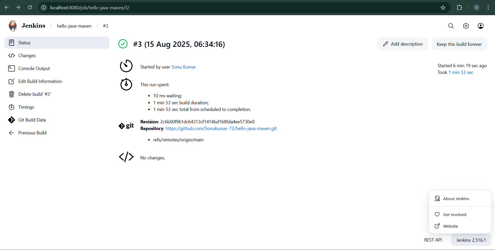
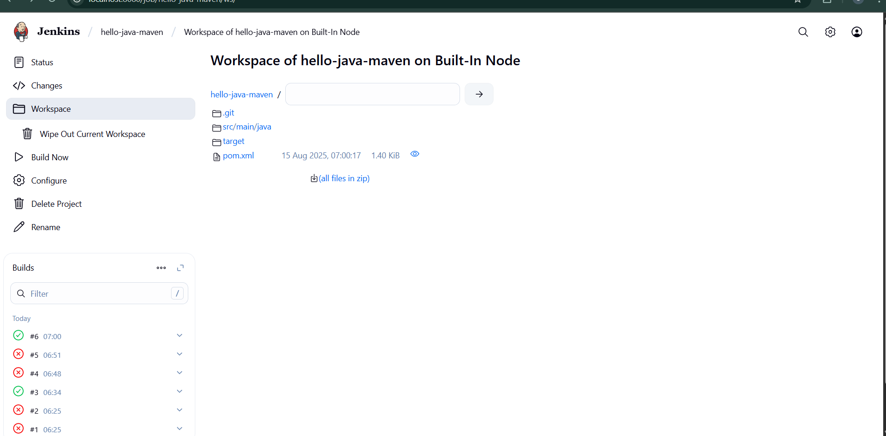
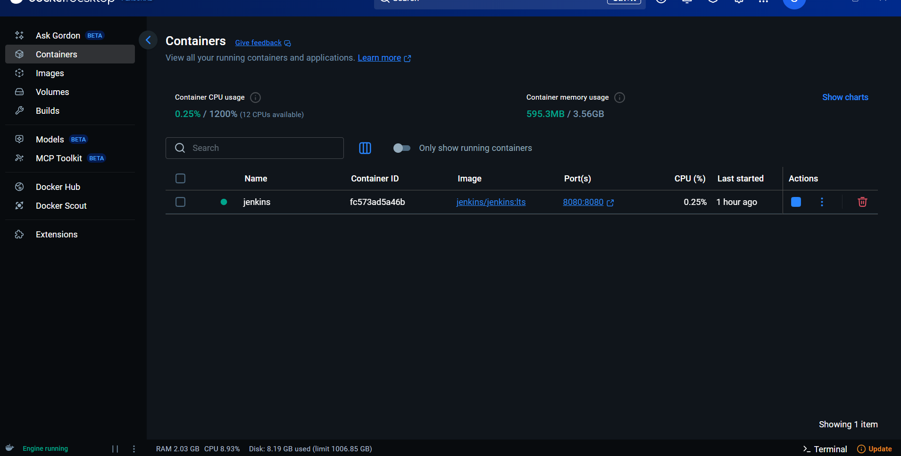
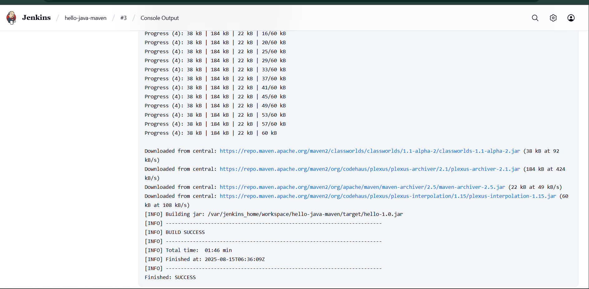

# 🚀 DevOps Task 8 — Java Build Automation with Jenkins & Maven

## 📌 Overview
This project demonstrates **continuous integration** using **Jenkins** and **Maven** to build a Java application.  
It covers:
- Setting up a Jenkins pipeline
- Configuring Maven for Java builds
- Automating build and verification processes

---

## 🛠 Tools & Technologies Used
- **Jenkins** (Automation Server)
- **Maven** (Java Build Tool)
- **Java** (Backend Programming Language)
- **Git** (Version Control)
- **Linux CLI** (Command Line Interface)
- **nano** editor (for file editing)

---

## 📸 Screenshots

> **💡 Tip:** Save all these images in a folder named `screenshots` in your repo root.  
> Example: `project-root/screenshots/01-jenkins-dashboard.png`

| Step | Description | Screenshot |
|------|-------------|------------|

|   | output |  |
| 2 | command |  |
| 3 | Maven Installation Config |  |
| 4 | Created Maven Project |  |
| 5 | docker  |  |
| 6 | Jenkins Build Success |  |

---

## 🏁 Final Output
- Automated build triggered from GitHub
- Maven compiles and packages code
- Docker image built and pushed to Docker Hub
- Application deployed and accessible

---

## 👨‍💻 Author
**Sonu Yadav**  
📧 Email: [yadavsonu772003@gmail.com](mailto:yadavsonu772003@gmail.com)  
🔗 GitHub Repo: [Sonukumar-72/hello-java-maven](https://github.com/Sonukumar-72/hello-java-maven)  

---

✨ *"Automate everything — because life’s too short for manual builds!"*
